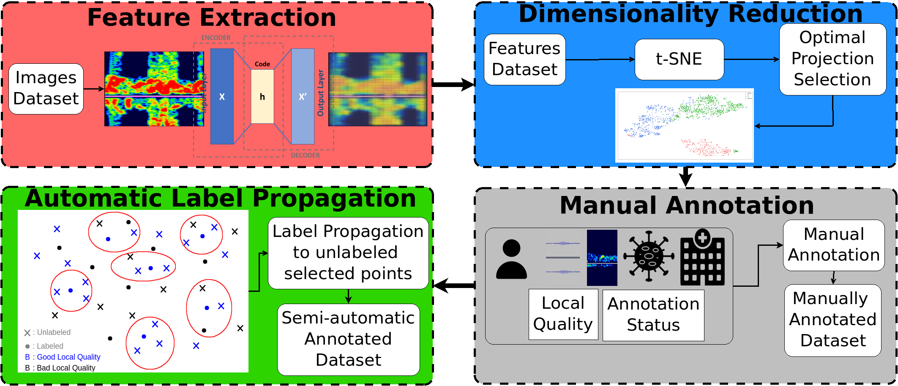
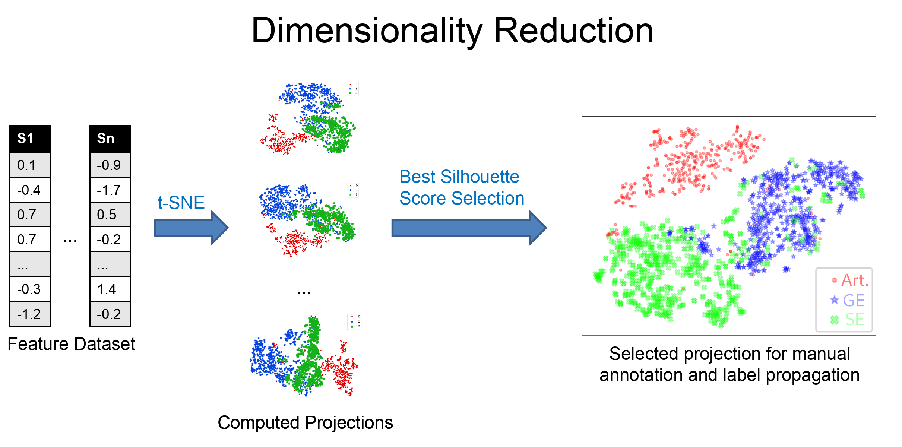
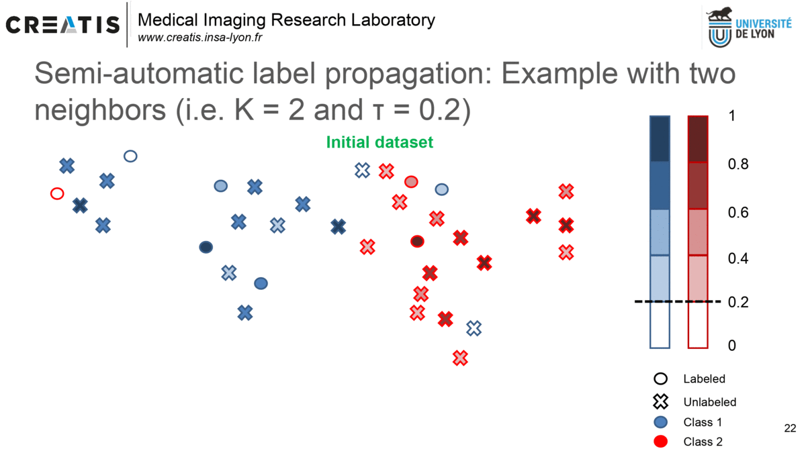
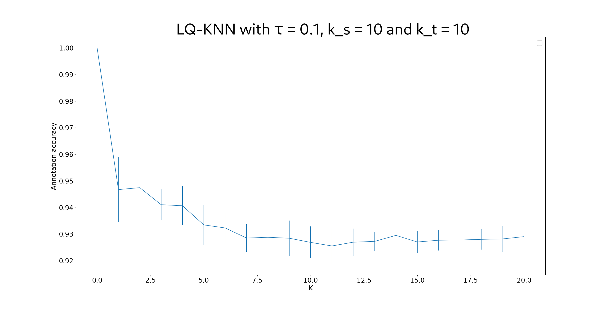
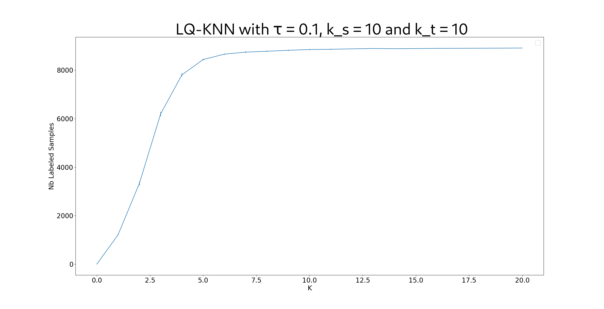

# Semi-automatic data annotation based on feature space projection and local quality metrics: An application to Cerebral Emboli characterization

## I) Introduction

This repository presents the code of the MNIST experiments of the submitted paper *Semi-automatic data annotation based on feature space projection and local quality metrics: An application to Cerebral Emboli characterization*.

## II) Configuration

To be able to run the different codes, you need to start by running the following command:

        export PYTHONPATH="${PYTHONPATH}:pathToTheLQ-KNN_DataAnnotation_Code"

Then, you should install the different libraries needed to execute the different codes:

        pip install -r requirements.txt

## II) Proposed Method

Our proposed method is composed of four steps:
* **Feature Extraction**:  we start by extracting features in an unsupervised manner using an Autoencoder adapted to our data. Using unsupervised learning techniques allows to avoid handcrafted features and to use all the available samples (labeled and unlabeled).
* **Dimensionality Reduction**: we reduce the dimension of the latent space of the previous step to obtain a 2D space. This allows to do a more efficient automatic and manual labeling of the samples as showed in [Benato et al. (2020)](
https://doi.org/10.1016/j.patcog.2020.107612). In this step, we compute different projections and we select the optimal projection using the *Silhouette Score*.
* **Manual annotation**: From the selected projectin in the previous step, a manual annotation is done in order to cover the whole annotation space. This step **is not tested** in this Git repository.
* **Automatic label propagation**: by considering the local projection quality of each sample in the 2D space ([Lueks et al. (2011)](https://arxiv.org/abs/1110.3917)), we propagate the labels of high quality labeled samples to high quality unlabeled samples. This allows to create a richer training-set with reduced effort.

Finally, once we obtained the final semi-automatically labeled dataset, we propose to do supervised classification using a robust loss function to compensante the noise introduced by the automatic label propagation.

## III) Code Structure

The code is structured in different folders:
* **datasets**: This folder will store the different datasets used to test our proposed semi-automatic data annotation method.
* **src**: This folder contains the source codes necessary to run the different examples. In this folder we can find the code *label_propagation.py* which implements our proposed method. More details about this folder can be found in the README.md file of this folder.
* **examples**: This folder contains different examples corresponding to different experiments that we perform in our submitted paper. For more details refer to the README.md file in the folder.
* **parameters_files**: This folder contains json files with the parameters of different experiments. By default there is a file with the train parameters of the auto-encoder for feature extraction (first step of our method) and another file with the parameters to train a classification model using a semi-automatically labeled dataset.
* **models**: This folder will store the different models obtained with the source codes and their results. For example, in this folder you can find the trained auto-encoders and the results of label-propagation using that auto-encoder.
* **utils**: This folder contains some useful codes to plot the 2D projections, the training  metrics of the auto-encoders, the annotation performances of a label propagation method, etc.
* **figs**: This fodler contains the different figures used as illustrations in this Git repository.

## IV) Examples

### A) General Example

To execute a simple experiment doing label propagation you can simply execute the code "label_propagation.py" in the "examples" folder:  

        python ./examples/label_propagation.py

This code will generate two figures for our proposed method with $\tau=0.1$:
*  One showing the annotation accuracy with respect to the considered neighborhood used for label propagation.
*  Another one showing the number of labeled samples with respect to the considered neighborhood used for label propagation.

### B) Other Examples

In the folder *examples* you can find some codes testing the main blocks of our proposed method. For more details, you can refer to the [README.md](https://github.com/yamilvindas/LQ-KNN_DataAnnotation/blob/main/examples/README.md) file of this folder.

## V) How to use our method with other datasets ?

Our method is generic and can be used with different datasets. Indeed, each block of our method can be adapted to each dataset. For instance, if your dataset is an audio dataset, you can use an LSTM, RNN or Transfomer architecture to do the feature extraction part. You can also use other dimensionality reduction techniques to obtain the final 2D space (although we recommend t-SNE as it preserves better the local structure than other methods).
To understand the behavior of our method on your dataset we recommend that you take the following steps:
* Let's suppose that you have a dataset *D* composed of a set of *L* labeled samples and a set *U* of unlabeled samples. Let's denote by *l* the proportion of labeled samples (i.e. the ratio between the cardinal of *L* and the cardinal of *D*).
* First, start by studying the bahavior of our method using only *L*:
    - Divide *L* between a set of labeled samples *LL* and another set of unlabeled samples *LU* in order to have *l* labeled samples in this dataset. As the trye labels of the samples of *LU* are known, when labeling *LU* you can compute the annotation accuracy of the method.
    - Test our method with different values of the hyper-parameters (values for *k_s*, *k_t*, *K* and *\tau*) to propagate the labels from *LL* to *LU*. As you have the true labels of the samples in *LU* you can compute the annotation accuracy as well as the percentage of labeled samples.
    - This will allow you to get an estimation of the annotation error that you can make on your dataset with different values of the hyper-parameters. 
    - You can then choose the values of the hyper-parameters allowing you to get the best trade-off between the annotation error and the percentage of labeled samples for you application.
* Then, using the hyper-parameters chosen in the previous step, you can propagate the labels from the samples of *L* to the samples of *U*.

It is also possible to directly propagate the labels from *L* to *U* for different value sof the hyper-parameters and train your supervised models using a robust loss function as shown in the submitted paper (however, in this case you do not have an estimation of the annotation error).
