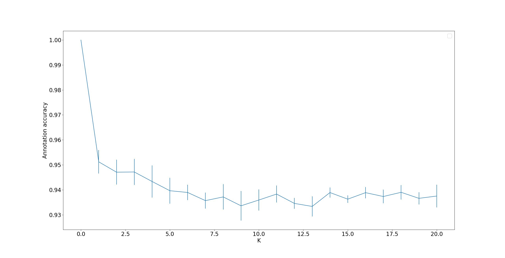
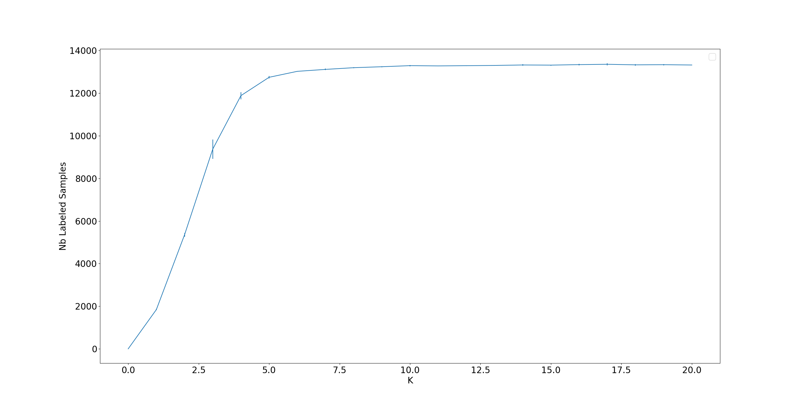

# Semi-automatic data annotation based on feature space projection and local quality metrics: An application to Cerebral Emboli characterization

## I) Introduction

This repository presents the code of the MNIST experiments of the submitted paper *Semi-automatic data annotation based on feature space projection and local quality metrics: An application to Cerebral Emboli characterization*.

## II) Proposed Method

Our proposed method is composed of four steps:
* **Feature Extraction**:  we start by extracting features in an unsupervised manner using an Autoencoder adapted to our data. Using unsupervised learning techniques allows to avoid handcrafted features and to use all the available samples (labeled and unlabeled). 
* **Dimensionality Reduction**: we reduce the dimension of the latent space of the previous step to obtain a 2D space. This allows to do a more efficient automatic and manual labeling of the samples as showed in [Benato et al. (2020)](
https://doi.org/10.1016/j.patcog.2020.107612). In this step, we compute different projections and we select the optimal projection using the *Silhouette Score*.
* **Manual annotation**: From the selected projectin in the previous step, a manual annotation is done in order to cover the whole annotation space. This step **is not tested** in this Git repository.
* **Automatic label propagation**: by considering the local projection quality of each sample in the 2D space ([Lueks et al. (2011)](https://arxiv.org/abs/1110.3917)), we propagate the labels of high quality labeled samples to high quality unlabeled samples. This allows to create a richer training-set with reduced effort.

Finally, once we obtained the final semi-automatically labeled dataset, we propose to do supervised classification using a robust loss function to compensante the noise introduced by the automatic label propagation.

## III) Code Structure

The code is structured in different folders:
* **datasets**:
* **src**:
* **examples**:
* **parameters_files**:
* **models**:
* **utils**:
* **figs**:

TODO: DESCRIPTION OF EACH FOLDER

## IV) Examples

### A) General Example

To execute a simple experiment doing label propagation you can simply execute the code "label_propagation.py" in the "examples" folder: 

**python ./examples/label_propagation.py**

This code will generate two figures for our proposed method with $\tau=0.1$:
*  One showing the annotation accuracy with respect to the considered neighborhood used for label propagation.
*  Another one showing the number of labeled samples with respect to the considered neighborhood used for label propagation.

### B) Other Examples

TODO 

