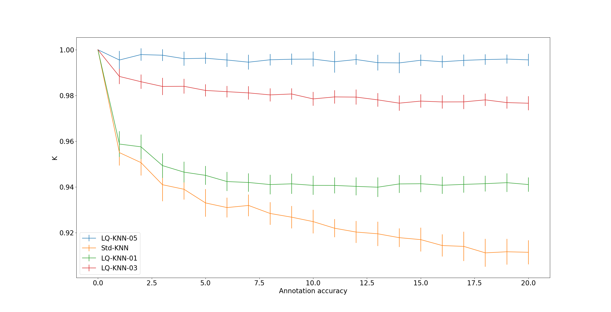

# Useful functions

 This folder contains some useful codes used to download some data that is used by some codes in the foder *examples* and some useful function to plot the results of the different steps of our method (e.g. auto-encoder training and testing metrics, annotation performances, classification performances, projection metrics, etc.)
 
 ## I) *download_exps_data.py*
 
 This code contains some functions allowing to download the data used to run some examples in the folder *examples*. It avoids to relaunch all the computations so different blocks can be tested independetly and relatively quickly.
 
 ## II) *plot_annotation_performances.py*
 
 Plot the annotation accuracy and the number of labeled samples obtained when evaluating a label propagation method using the code *examples/evaluation_label_propagation.py*.
 It has two options:
 * *label_prop_results_folder*: Path to a label propagation results folder (obtained using the code examples/evaluation_label_propagation.py)
 * *var_to_study*: Studied variable which indicates which results have to be plotted.  
 * *default_dataset*: Default dataset to plot the results (it uses precomputed metics). Two options: MNIST and OrganCMNIST. Only used if --label_prop_results_folder is None.
 
If the code is launched without any option, it will show the results of precomuted label propagation runs:

 
 ## III) *plot_classification_results.py*
 
Plot the results of a classification experiment using a semi-automatically labeled dataset. It has one option:
* *classif_res_folder*: Path to the folder containing the classfication results. This folder is usually obtained using the code *example/label_propagation_with_classification.py*.
* *default_dataset*: Default dataset to plot the results (it uses precomputed metics). Two options: MNIST and OrganCMNIST. Only used if --classif_res_folder is None

If the code is launched without any options, it will plot the classification results shown in the submitted paper:

 
 ## IV) *plot_metrics_AE.py*
 
This code allows to plot the train and test metrics curves obtained by training an AutoEncoder model using the codes *src/feature_extraction.py* or *examples/feature_extraction.py*. It has one option:
* *metrics_file*: Path to the metrics .pth file of a trained AE model. This file is usually stored in a folder of the form "../models/MNIST_EXP_ID/Model/".
 
 ## V) *plot_projection_quality_metrics.py*
 
 This code allows to plot the different projection metrics obtained using the code *src/projection_metrics.py*. It has two options:
* *projections_file_folder*: Path to the folder containing the representations_0.pth file corresponding to the final embedded representation of the original samples (in general 2D points).
* *projection_metric_file*: Path to the file contraining the projection metric.
 
 ## VI) *tools.py*
 
This code implements different functions used to compute the testing loss of an auto-encoder, save its metrics, load its metrcs, etc. For more detail look the the documentation inside the code.
